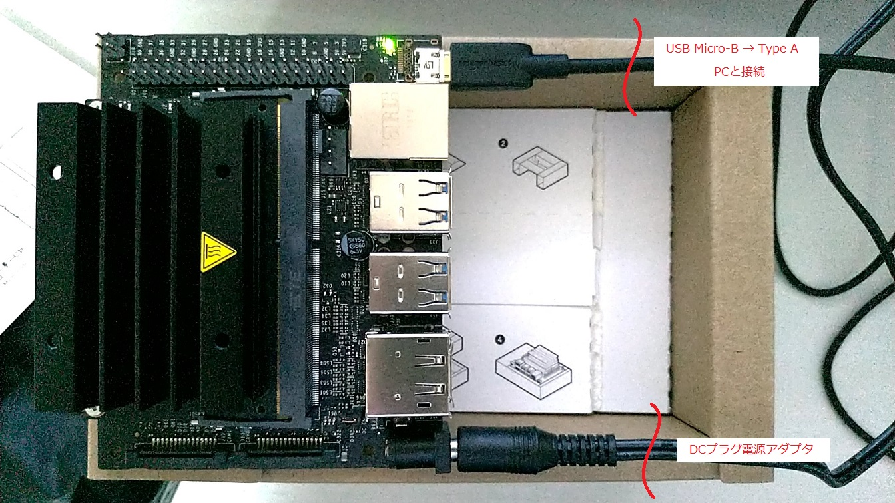

# Jetson Nano

- [Jetson Nano](https://www.nvidia.com/ja-jp/autonomous-machines/embedded-systems/jetson-nano-developer-kit/)
    - nVidia から発売されている AI 開発キット
    - AIの学習に最適な小型でパワフルなコンピューターで、ロボティクスの最初のステップとなる
    - リアルタイムの画像分類、物体検出、セグメンテーション、音声処理など、ディープラーニングをエッジに配備可能
    - 学習者、メーカー、開発者が最初の AI プロジェクトに取りかかるときに、PyTorch や TensorFlow など人気の機械学習フレームワークについて学習するのに最適なツール

## Setup

- 参考:
    - [【JetCardを使えば一瞬】NVIDIA Jetson Nanoセットアップ](https://qiita.com/tomo_makes/items/859c4f8aa71d3209d591)

### 購入したもの
- Jetson Nano Developer Kit B01
    - ￥11,400
    - [SWITCH SCIENCE](https://www.switch-science.com/catalog/6239/)
- microSDXC 256GB Sandisk (UHS-I)
    - ￥5,800
    - [Amazon](https://www.amazon.co.jp/gp/product/B07H86LWMS/ref=ppx_yo_dt_b_asin_title_o01_s00?ie=UTF8&psc=1)
    - 最低32GB, UHS-I 対応のものが必要
- 電源アダプタ (5V, 4A, 2.1mm内径DCプラグ)
    - ￥1,380
    - [Amazon](https://www.amazon.co.jp/gp/product/B015RKFAA2/ref=ppx_yo_dt_b_asin_title_o01_s00?ie=UTF8&psc=1)
- USBケーブル (Micro-B to Type-A)
    - ￥598
    - [Amazon](https://www.amazon.co.jp/gp/product/B0711PVX6Z/ref=ppx_yo_dt_b_asin_title_o01_s00?ie=UTF8&psc=1)
- 2pinジャンパ (ジャンパキャップ, 電源プラグ給電用)
    - 100個入 ￥635
    - [Amazon](https://www.amazon.co.jp/gp/product/B00R1LEP6G/ref=ppx_yo_dt_b_asin_title_o00_s00?ie=UTF8&psc=1)
    - J48をショートしDCプラグ型電源を使うため
    - ※ 新モデルの Jetson Nano B01 には付属していたため不要
- Raspberry Pi カメラモジュール V2
    - ￥3,280
    - [Amazon](https://www.amazon.co.jp/gp/product/B07W6NK7TW/ref=ppx_yo_dt_b_asin_title_o02_s00?ie=UTF8&psc=1)
- Jetson Nano 冷却ファン＋カメラホルダー付きケース
    - ￥3,299
    - [Amazon](https://www.amazon.co.jp/gp/product/B089RNSLLD/ref=ppx_yo_dt_b_asin_title_o02_s00?ie=UTF8&psc=1)

### JetCardイメージのインストール
- JetCardイメージの準備
    - 必要なソフトウェアがプリインストールされた nVidia 公式SDカードイメージ
    - [GitHub](https://github.com/NVIDIA-AI-IOT/jetcard) にある [jetcard_v0p0p0.zip](https://drive.google.com/open?id=1wXD1CwtxiH5Mz4uSmIZ76fd78zDQltW_) をダウンロード（7GB）
- SDカードの準備
    - [SDメモリカードフォーマッター](https://www.sdcard.org/jp/downloads/formatter/) を使うのが簡単
    - exFAT でクイックフォーマットしておけば良い
- JetCardイメージをSDカードに書き込む
    - [Etcher](https://www.balena.io/etcher/) を使ってJetCardイメージをSDカードに書き込む

### 起動
JetCardをインストールしたSDカードを挿入

DCプラグ電源アダプタを配線し、電源を入れる（J48ショート用のジャンパが付属していない場合は、自分で2pinジャンパを取り付けてショートさせる）

USB Micro-B => Type-A を配線して、PCと接続する

http://192.168.55.1:8888 を開くと、Jetson Nano 内部の Jupyter Notebook に接続できる

デフォルトパスワード `jetson` でサインインする
