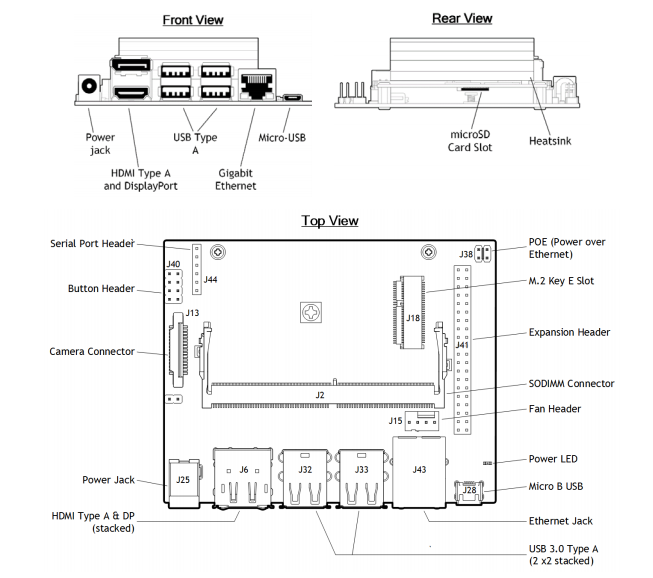
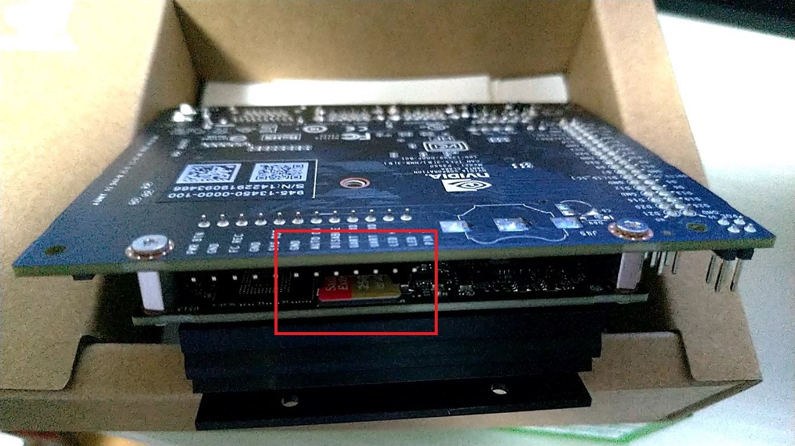
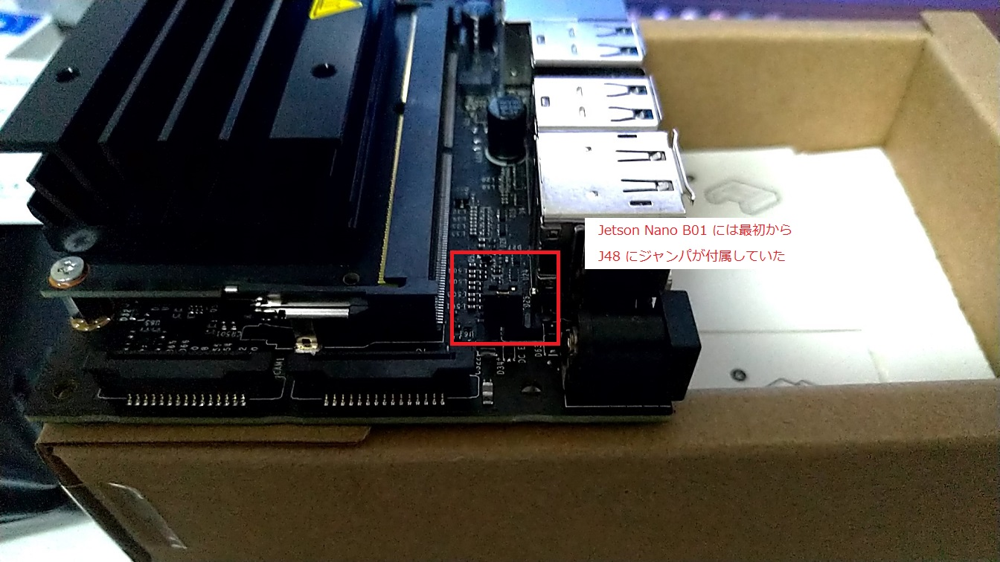
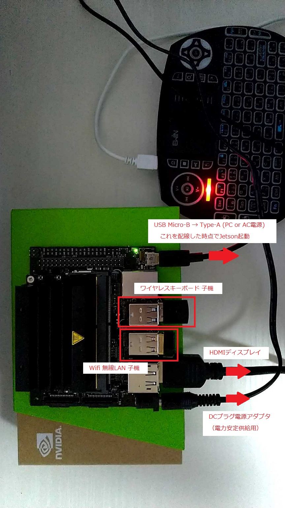
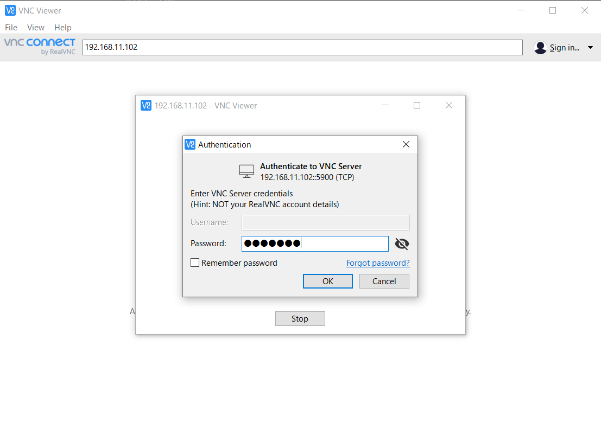
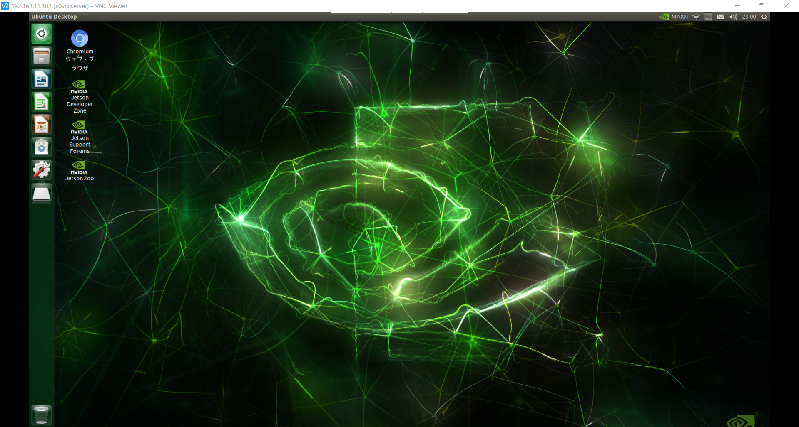

# Jetson Nano

- [Jetson Nano](https://www.nvidia.com/ja-jp/autonomous-machines/embedded-systems/jetson-nano-developer-kit/)
    - nVidia から発売されている AI 開発キット
    - AIの学習に最適な小型でパワフルなコンピューターで、ロボティクスの最初のステップとなる
    - リアルタイムの画像分類、物体検出、セグメンテーション、音声処理など、ディープラーニングをエッジに配備可能
    - 学習者、メーカー、開発者が最初の AI プロジェクトに取りかかるときに、PyTorch や TensorFlow など人気の機械学習フレームワークについて学習するのに最適なツール

## Environment

- PC:
    - OS: `Windows 10`
    - Shell: `PowerShell`
    - Package Manager: `Chocolatey`
- Jetson:
    - Device: `Jetson Nano Developer Kit B01`
    - OS: `JetPack 4.4`

***

## Setup

- 参考:
    - [Amazonでまとめて買える！Jetson Nanoのおすすめ周辺機器](https://karaage.hatenadiary.jp/entry/2019/08/19/073000)
    - [2020年 Jetson Nanoのおすすめwifiドングルはコレ!](https://qiita.com/akinko/items/c01ed6b891f2117f5ed9)
    - [Jetson Nanoにリモートデスクトップ(VNC)環境を用意する](https://qiita.com/iwatake2222/items/a3bd8d0527dec431ef0f)
    - [Getting Started with the NVIDIA Jetson Nano Developer Kit](https://www.hackster.io/news/getting-started-with-the-nvidia-jetson-nano-developer-kit-43aa7c298797)
    - [【VNC】Jetsonにリモートデスクトップを設定する方法](https://dev.classmethod.jp/articles/jetson-remote-desktop-with-vnc/)

### 購入したもの
- Jetson Nano Developer Kit B01
    - ￥11,400
    - [SWITCH SCIENCE](https://www.switch-science.com/catalog/6239/)
- microSDXC 256GB Sandisk (UHS-I)
    - ￥5,800
    - [Amazon](https://www.amazon.co.jp/gp/product/B07H86LWMS/ref=ppx_yo_dt_b_asin_title_o01_s00?ie=UTF8&psc=1)
    - 最低32GB, UHS-I 対応のものが必要
- 電源アダプタ (5V, 4A, 2.1mm内径DCプラグ)
    - ￥1,380
    - [Amazon](https://www.amazon.co.jp/gp/product/B015RKFAA2/ref=ppx_yo_dt_b_asin_title_o01_s00?ie=UTF8&psc=1)
- USBケーブル (Micro-B to Type-A)
    - ￥598
    - [Amazon](https://www.amazon.co.jp/gp/product/B0711PVX6Z/ref=ppx_yo_dt_b_asin_title_o01_s00?ie=UTF8&psc=1)
- TP-Link Wifi 無線LAN 子機 TL-WN725N
    - ￥713
    - [Amazon](https://www.amazon.co.jp/gp/product/B008IFXQFU/ref=ppx_yo_dt_b_asin_title_o01_s00?ie=UTF8&psc=1)
    - ※ この無線LANは JetPack 4.4 でドライバ不要で認識した
    - ※ 子機を接続 => 電源ONにした後、`Fn + F1` キーを押さないと接続されないため注意
- Ewin ワイヤレスキーボード2.4GHz (ミニ型 タッチパッド搭載)
    - ￥2,380
    - [Amazon](https://www.amazon.co.jp/gp/product/B08CDXLWJ9/ref=ppx_yo_dt_b_asin_title_o01_s00?ie=UTF8&psc=1)
    - ※ このワイヤレスキーボードは JetPack 4.4 でドライバ不要で認識した（タッチパッド搭載のためマウスも不要）
- Lepow ポータブルモニター 15.6インチ
    - ￥16,983
    - [Amazon](https://www.amazon.co.jp/gp/product/B0819J8GN1/ref=ppx_yo_dt_b_asin_title_o03_s00?ie=UTF8&psc=1)
    - ※ 元々メインPCのサブディスプレイとして購入したもの（HDMI接続可能なディスプレイなら何でも良い）
- 2pinジャンパ (ジャンパキャップ, 電源プラグ給電用)
    - 100個入 ￥635
    - [Amazon](https://www.amazon.co.jp/gp/product/B00R1LEP6G/ref=ppx_yo_dt_b_asin_title_o00_s00?ie=UTF8&psc=1)
    - J48をショートしDCプラグ型電源を使うため
    - ※ 新モデルの Jetson Nano B01 には付属していたため不要
- Raspberry Pi カメラモジュール V2
    - ￥3,280
    - [Amazon](https://www.amazon.co.jp/gp/product/B07W6NK7TW/ref=ppx_yo_dt_b_asin_title_o02_s00?ie=UTF8&psc=1)
- Jetson Nano 冷却ファン＋カメラホルダー付きケース
    - ￥3,299
    - [Amazon](https://www.amazon.co.jp/gp/product/B089RNSLLD/ref=ppx_yo_dt_b_asin_title_o02_s00?ie=UTF8&psc=1)

### OS (JetPack) のインストール
- OSイメージの準備
    - 2020年9月時点で最新の [JetPack 4.4 Jetson Nano Development Kit](https://developer.nvidia.com/jetson-nano-sd-card-image) をダウンロード（6GB）
- SDカードの準備
    - [SDメモリカードフォーマッター](https://www.sdcard.org/jp/downloads/formatter/) を使うのが簡単
    - exFAT でクイックフォーマットしておけば良い
- OSイメージをSDカードに書き込む
    - [Etcher](https://www.balena.io/etcher/) を使って JetPack 4.4 イメージをSDカードに書き込む
    - ※ Etcher は zip 圧縮されたイメージをそのままSDカードに書き込めるため、解凍する必要はない

#### イメージ書き込み済みのSDカードをフォーマットしたい場合
`Win + X` |> `A` => 管理者権限 PowerShell 起動

```powershell
# diskpart 起動
> diskpart

# PCに接続されているストレージ一覧確認
DISKPART> list disk

  ディスク      状態           サイズ   空き   ダイナ GPT
  ###                                          ミック
  ------------  -------------  -------  -------  ---  ---
  ディスク 0    オンライン           931 GB  1024 KB        *
  ディスク 1    オンライン           476 GB      0 B        *
  ディスク 2    オンライン           931 GB      0 B
  ディスク 3    オンライン           238 GB      0 B        *

# SDカード（256GB）と思われる ディスク 3 を選択
DISKPART> select disk 3

# disk 3 を clean
DISKPART> clean

# 確認
## ディスク 3 の空き容量がサイズと同じになっていればOK
DISKPART> list disk

  ディスク      状態           サイズ   空き   ダイナ GPT
  ###                                          ミック
  ------------  -------------  -------  -------  ---  ---
  ディスク 0    オンライン           931 GB  1024 KB        *
  ディスク 1    オンライン           476 GB      0 B        *
  ディスク 2    オンライン           931 GB      0 B
* ディスク 3    オンライン           238 GB   238 GB        *

# ボリューム一覧確認
## 以下の場合、Volume 5 がSDカードのボリュームと思われる
DISKPART> list volume

  Volume ###  Ltr Label        Fs    Type        Size     Status     Info
  ----------  --- -----------  ----  ----------  -------  ---------  --------
  Volume 0     E                       DVD-ROM         0 B  メディアなし
  Volume 1     D   Data         NTFS   Partition    931 GB  正常
  Volume 2     C   Windows      NTFS   Partition    460 GB  正常         ブート
  Volume 3         SYSTEM       FAT32  Partition    300 MB  正常         システム
  Volume 4     G   Extreme SSD  exFAT  Partition    931 GB  正常
  Volume 5                             リムーバブル          0 B  使用不可

# ↑ Volume 5 の Status が使用不可になっているためパーティションを作成する
DISKPART> select disk 3
DISKPART> create partition primary
```

上記操作の後、SDメモリカードフォーマッターを使って exFAT フォーマットする

### 起動
JetPackをインストールしたSDカードを挿入





DCプラグ電源アダプタを配線し、電源を入れる（J48ショート用のジャンパが付属していない場合は、自分で2pinジャンパを取り付けてショートさせる）

※ この時点ではまだ起動しない



HDMI端子をディスプレイに配線し、Wifi 無線LAN 子機、ワイヤレスキーボード子機 をUSB接続する

さらに USB Micro-B => Type-A を配線して、PC（or AC電源）と接続すると、Jetson が起動する



### 初期設定
接続したHDMIディスプレイを見ながらGUIで初期設定を行う

Ewinワイヤレスキーボードは、`Fn + F1` キーを押すと子機と接続されるため、接続後にタッチパッドとキーボードを使って設定を行う

- 言語: `日本語`
- キーボード配列: `日本語`
- タイムゾーン: `Asia/Tokyo`
- ログイン設定: ※ ログイン、SSH接続時に必要な情報のため忘れないようにする
    - ユーザ名: `user` (任意)
    - マシン名: `user-jetson` (任意)
    - パスワード: `pass` (※なるべく他人に推測されにくいものを設定すること)
    - [x] 自動ログインする

起動したら `Ctrl + Alt + T` キーでターミナル起動

```bash
# Wifiリスト確認
## TP-Link Wifi 無線LAN 子機 TL-WN725N を使っている場合、ドライバ等不要でそのままWifiを認識するはず
$ nmcli dev wifi list

IN-USE  SSID      MODE   CHAN  RATE        SIGNAL  BARS  SECURITY
...
       ASUS_20_2G  Infra  4     44 Mbit/s  100     ▂▄▆█  WPA2

# 自分の使っているWifiに接続する
$ nmcli dev wifi connect <SSID> password <wifi_password>

# Wifiネットワーク内でJetsonに割り当てられたIPv4アドレスを確認
$ ifconfig wlan0

wlan0: flags=4163<UP,BROADCAST,RUNNING,MULTICAST>  mtu 1500
        inet 192.168.11.102  netmask 255.255.255.0  broadcast 192.168.11.255
        ...
# => 上記の場合 192.168.11.102 がJetsonのIPv4
```

以降はPCからSSH接続して操作できるため、この時点でディスプレイとキーボードは外してしまって良い

### リモートデスクトップ（VNC）環境構築
PC側からJetsonのGUI環境を操作できると何かと便利なため、VNCサーバを立ててリモートデスクトップ接続可能にする

```bash
# PowerShellからJetsonにSSH接続する
# $ ssh <user_name>@<jetson_ipv4>
## これまでの設定の場合は以下のコマンドでSSH接続
> ssh user@192.168.11.102
Password: # <= Jetson初期設定時に設定したログインパスワード（今回の場合 `pass`）

# -- user@192.168.11.102

# システム更新
$ sudo apt update && sudo apt upgrade -y

# VNCサーバ導入
$ sudo apt install tigervnc-common tigervnc-standalone-server tigervnc-scraping-server

# VNC接続用パスワード設定
$ vncpasswd
Password: # <= 6文字以上の任意パスワードを設定（今回は `vncpass` とした）
Verify: # <= パスワードをもう一度入力
Would you like to enter a view-only password (y/n)? # <= VNC経由で画面操作を行いたかったため `n`

# HDMIディスプレイが接続されていないJetsonの仮想スクリーンは 640x480 で小さい
# そのため、仮想スクリーンサイズを 1280x800 に設定
$ sudo tee -a /etc/X11/xorg.conf << EOS
Section "Monitor"
   Identifier "DSI-0"
   Option    "Ignore"
EndSection

Section "Screen"
   Identifier    "Default Screen"
   Monitor        "Configured Monitor"
   Device        "Default Device"
   SubSection "Display"
       Depth    24
       Virtual 1280 800
   EndSubSection
EndSection
EOS

# VNCサーバをデーモンとして登録
$ sudo tee /etc/systemd/system/x0vncserver.service << EOS
[Unit]
Description=Remote desktop service (VNC)
After=syslog.target
After=network.target remote-fs.target nss-lookup.target
After=x11-common.service 

[Service]
Type=forking
User=$USER
Group=$USER
WorkingDirectory=$HOME
ExecStart=/bin/sh -c 'sleep 10 && /usr/bin/x0vncserver -display :0  -rfbport 5900 -passwordfile $HOME/.vnc/passwd &'

[Install]
WantedBy=multi-user.target
EOS

# VNCサーバデーモンを自動起動登録＆起動
$ sudo systemctl enable x0vncserver
$ sudo systemctl start x0vncserver

# VNCサーバデーモン状態確認
$ sudo systemctl status x0vncserver
● x0vncserver.service - Remote desktop service (VNC)
   Loaded: loaded (/etc/systemd/system/x0vncserver.service; enabled; vendor preset: enabled)
   Active: active (running)
   ...
```

#### VNC Viewer から接続
`Win + X` |> `A` => 管理者権限 PowerShell 起動

```powershell
# Chocolatey で VNC Viewer インストール
> choco install -y vnc-viewer
```

インストールされたら Windows スタートメニューから `VNC Viewer` 起動

- Enter a VNC server address or search: `192.168.11.102` (JetsonのIPv4)
    - Password: `vncpass` (`vncpasswd` コマンドで設定したパスワード)




